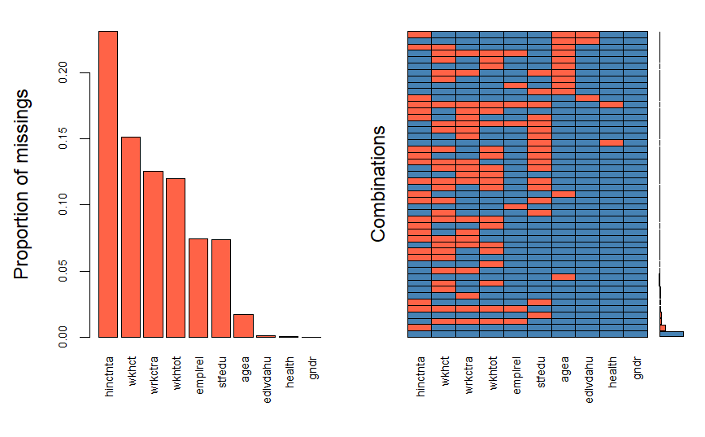
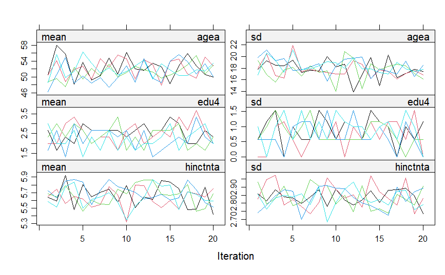
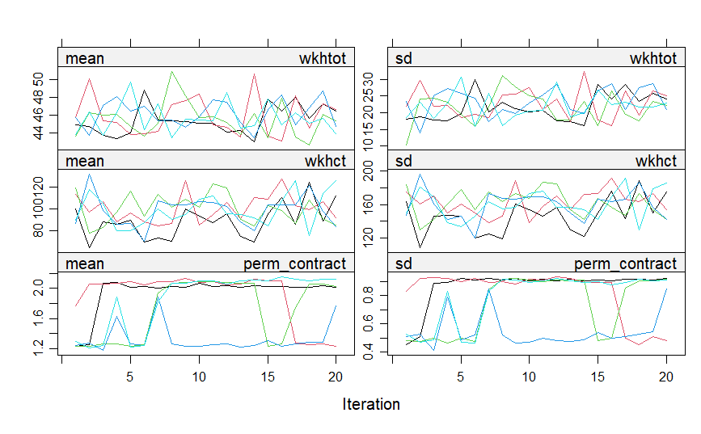
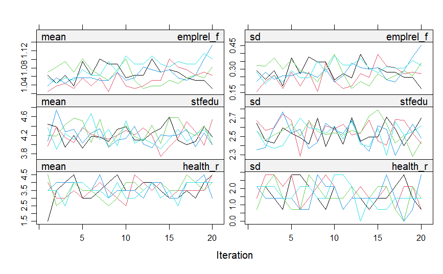
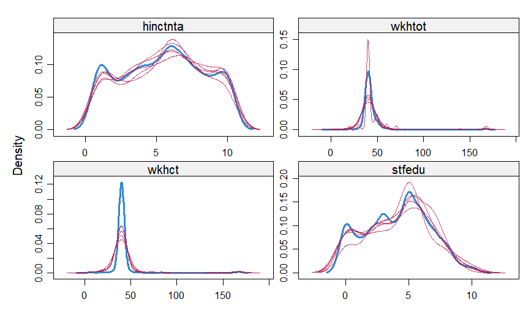
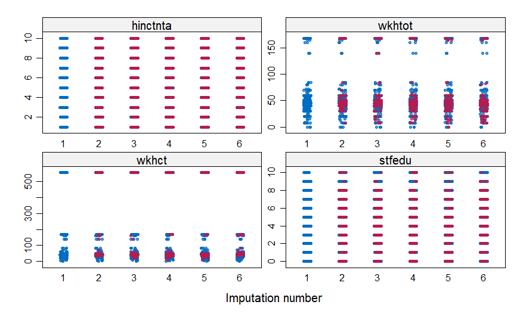

# Multiple Imputation Pipeline 

This project implements a full **Multiple Imputation by Chained Equations (MICE)** pipeline on survey data from the European Social Survey (ESS) Round 11, Hungary. The goal is to handle missing data properly before running regression analyses, and to compare results between MI-pooled estimates and complete-case analysis.

---

## 📦 Required Packages

```r
install.packages(c("haven", "mice", "VIM", "naniar"))
```

| Package | Purpose |
|---------|---------|
| `haven` | Load SPSS `.sav` files |
| `mice` | Multiple imputation (MICE algorithm) |
| `VIM` | Missing data visualisation |
| `naniar` | MCAR test and missing data summaries |

---

## 📁 Data

**Source:** [European Social Survey (ESS) Round 11 – Hungary](https://ess.sikt.no/en/country/321b06ad-1b98-4b7d-93ad-ca8a24e8788a/hu/)

> The data must be downloaded directly from the ESS website (registration required). It cannot be redistributed here.

**Variables used:**

| Variable | Description |
|----------|-------------|
| `agea` | Age of respondent (calculated) |
| `gndr` | Gender |
| `edlvdahu` | Highest level of education – Hungary (ISCED) |
| `hinctnta` | Household total net income, all sources (decile) |
| `wkhtot` | Total hours normally worked per week (incl. overtime) |
| `wrkctra` | Employment contract type |
| `wkhct` | Hours per week in main job, contracted |
| `emplrel` | Employment relation |
| `stfedu` | State of education in country nowadays |
| `health` | Subjective general health |

---

## 🔍 Missing Data Analysis

### Missing rates per variable

```
agea     gndr  edlvdahu  hinctnta    wkhtot   wrkctra     wkhct   emplrel    stfedu    health
 1.7      0.0       0.1      23.1      12.0      12.6      15.2       7.5       7.4       0.1
```

`hinctnta` (household income) has the highest missingness at **23.1%**. `wkhct` (contracted hours) has **15.2%** missing.

### Missing data pattern



The left panel shows that `hinctnta` (23.1%) and `wkhct` (15.2%) have the 
highest proportion of missing values. The right panel reveals that these two 
variables frequently appear missing together with `wrkctra` and `wkhtot`, 
suggesting that respondents who did not report income also tended to skip 
employment-related questions. This pattern of co-occurring missingness 
supports the use of multivariate imputation.

### Little's MCAR Test

```
statistic = 2185, df = 342, p.value = 0, missing.patterns = 48
```

The null hypothesis that data is Missing Completely At Random (MCAR) is strongly rejected (p < 0.001). This confirms that missing values are systematically related to other variables, making **multiple imputation more appropriate than complete-case analysis**.

---

## ⚙️ Imputation Setup

The MICE algorithm was run with **m = 5 imputations** and **20 iterations**, using variable-appropriate methods:

| Variable | Type | Method |
|----------|------|--------|
| `agea`, `hinctnta`, `wkhtot`, `wkhct`, `stfedu` | Continuous | Predictive Mean Matching (`pmm`) |
| `edu4`, `health_r` | Ordered categorical | Proportional odds model (`polr`) |
| `gender` | Binary | Logistic regression (`logreg`) |
| `perm_contract`, `emplrel_f` | Nominal categorical | Polytomous regression (`polyreg`) |

---

## 📊 Diagnostics

### Convergence plots

The convergence plots show the mean and standard deviation of imputed values across 5 chains over 20 iterations. Good mixing between chains indicates the algorithm has converged.







### Density plots

Blue lines show the observed data distribution; red lines show the 5 imputed datasets. Close overlap indicates plausible imputations.



`hinctnta` and `stfedu` show reasonable overlap between observed and imputed distributions. 

For `wkhtot`, the observed distribution shows a sharper peak at 40 hours, reflecting the standard full-time working week. Imputed values are more dispersed, suggesting that respondents with missing working hours are more likely to be part-time workers whose hours are less regular.

For `wkhct`, imputed values show a  wider distribution compared to observed values. This is consistent with the possibility that respondents with missing contracted hours may lack a formal contract altogether — such as the self-employed or those working in family businesses — leading to greater uncertainty in the imputation model. 

### Strip plots



Imputed values (red, imputation numbers 2–6) follow a similar distribution to observed values (blue, imputation 1), confirming imputation quality across all variables.

### Stability across imputations

```
              [,1]   [,2]   [,3]   [,4]   [,5]    SD
agea        50.543 50.590 50.593 50.545 50.602  0.028
hinctnta     5.472  5.547  5.532  5.492  5.511  0.030
wkhtot      43.500 43.358 43.144 43.754 43.290  0.232
wkhct       41.631 41.684 41.737 42.203 41.780  0.228
stfedu       4.142  4.168  4.128  4.128  4.140  0.016
```

Standard deviations across the 5 imputed datasets are small relative to each variable's scale, confirming stable and consistent imputations.

---

## 📈 Results: MI vs Complete-Case Regression

**Outcome:** Household income decile (`hinctnta`)  
**Predictors:** Education level (`edu4`), subjective health (`health_r`), age (`agea`)

### MI Pooled estimates (Rubin's Rules)

```
term           estimate   std.error   statistic      p.value
(Intercept)    6.081      0.247       24.65          < 0.001
edu4.L         2.321      0.163       14.28          < 0.001
edu4.Q        -0.245      0.122       -2.02           0.044
edu4.C         0.344      0.123        2.80           0.008
health_r.L     1.872      0.301        6.21          < 0.001
health_r.C    -0.496      0.212       -2.33           0.022
agea          -0.020      0.004       -5.16          < 0.001
```

### Complete-Case estimates (listwise deletion)

```
term           estimate   std.error   t value    p.value
(Intercept)    5.836      0.312       18.699     < 0.001
edu4.L         2.335      0.182       12.863     < 0.001
edu4.C         0.395      0.132        2.985      0.003
health_r.L     2.034      0.387        5.249     < 0.001
health_r.C    -0.544      0.257       -2.116      0.035
agea          -0.014      0.005       -2.795      0.005

R-squared: 0.257 (1,247 obs after deletion)
```

### Key findings

- **Education** is the strongest predictor of income in both models (linear trend: β ≈ 2.32 in MI vs 2.34 in CC), confirming a robust positive relationship between education level and household income.
- **Health** has a significant positive linear effect on income. MI yields a slightly smaller estimate (β = 1.87) compared to complete-case (β = 2.03), suggesting that complete-case analysis may overestimate this effect due to the selective exclusion of respondents with missing income data.
- **Age** shows a negative effect on income. MI gives a stronger estimate (β = −0.020) than complete-case (β = −0.014), suggesting that complete-case analysis may have introduced bias by selectively removing respondents with missing income data.
- Multiple imputation recovers information from respondents with missing data across several variables, producing more reliable and generalisable estimates than complete-case analysis.

---

## 📤 Output Files

| File | Description |
|------|-------------|
| `ESS_HU_mids.rds` | Full `mids` object (all 5 imputations, for further analysis in R) |
| `ESS_HU_imputed_long.csv` | Long-format dataset with all 5 imputed datasets |
| `ESS_HU_imputed_complete.rds` | Single completed dataset (imputation 1) |
| `ESS_HU_codebook.csv` | Variable codebook |

---

## ▶️ How to Run

1. Download the ESS Round 11 Hungary data from the [ESS website](https://ess.sikt.no/en/country/321b06ad-1b98-4b7d-93ad-ca8a24e8788a/hu/) and place `ESS country data - HU.sav` in your working directory
2. Open `MI code.R` in RStudio
3. Required packages will be installed automatically if not already present.
4. Output files will be saved in your working directory


